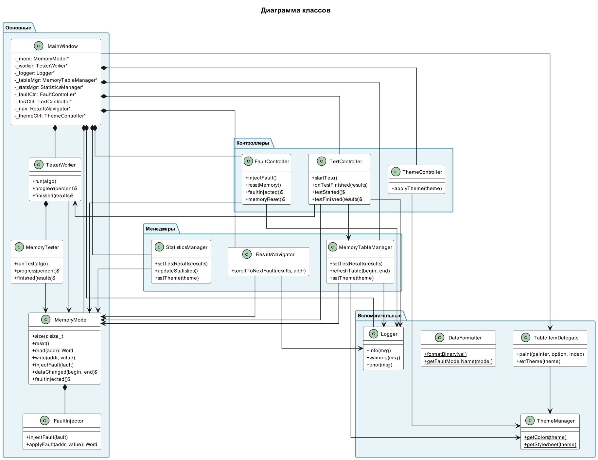

# Инструкция по использованию PlantUML в VS Code

## Установка и настройка

### 1. Установка расширения
Расширение "PlantUML" от jebbs уже установлено. Это расширение с 100,000+ загрузок.

### 2. Настройка расширения

Откройте настройки VS Code (`Ctrl+,` или `File > Preferences > Settings`) и найдите "PlantUML":

**Рекомендуемые настройки:**

1. **PlantUML: Server** - URL сервера для рендеринга
   - По умолчанию: `http://www.plantuml.com/plantuml`
   - Можно оставить по умолчанию (онлайн) или настроить локальный сервер

2. **PlantUML: Preview Auto Update** - Автообновление превью
   - Рекомендуется: `true` (включено)

3. **PlantUML: Export Format** - Формат экспорта
   - Доступны: `png`, `svg`, `pdf`, `eps`, `txt`
   - Рекомендуется: `png` для изображений, `svg` для векторной графики

4. **PlantUML: Export Out Dir** - Папка для экспорта
   - Можно оставить пустым (экспорт рядом с файлом)
   - Или указать: `docs/images/` для централизованного хранения

## Использование

### Просмотр диаграммы

1. **Откройте любой `.puml` файл** в VS Code
   - Например: `docs/class_diagram.puml`

2. **Откройте превью диаграммы:**
   - Нажмите `Alt+D` (Windows/Linux) или `Option+D` (macOS)
   - Или: `Ctrl+Shift+P` → введите "PlantUML: Preview Current Diagram"
   - Или: Правый клик на файле → "Preview PlantUML Diagram"

3. **Превью откроется в боковой панели** и будет автоматически обновляться при изменении файла

### Экспорт диаграммы в изображение

1. **Откройте `.puml` файл**

2. **Экспортируйте диаграмму:**
   - Нажмите `Ctrl+Shift+P` → введите "PlantUML: Export Current Diagram"
   - Или: Правый клик на файле → "Export Current Diagram"
   - Или: Используйте команду `Alt+Shift+E` (может не работать, зависит от настроек)

3. **Выберите формат:**
   - PNG - для презентаций и документов
   - SVG - для веб-страниц (масштабируемый)
   - PDF - для печати

4. **Изображение сохранится** рядом с исходным файлом или в указанной папке

### Экспорт всех диаграмм сразу

1. Откройте папку `docs/` в VS Code

2. Используйте команду:
   - `Ctrl+Shift+P` → "PlantUML: Export All Diagrams in Current Workspace"
   - Или: `Ctrl+Shift+P` → "PlantUML: Export All Diagrams in Current File"

### Быстрые команды (горячие клавиши)

| Действие | Горячая клавиша |
|----------|----------------|
| Превью диаграммы | `Alt+D` |
| Экспорт диаграммы | `Ctrl+Shift+P` → "Export Current Diagram" |
| Обновить превью | `Alt+R` (если автообновление выключено) |

## Решение проблем

### Проблема: "Cannot connect to PlantUML server"

**Решение:**
1. Проверьте интернет-соединение
2. Попробуйте другой сервер в настройках:
   - `http://www.plantuml.com/plantuml` (официальный)
   - `https://www.plantuml.com/plantuml` (HTTPS версия)
3. Установите локальный сервер PlantUML (см. ниже)

### Проблема: Диаграмма не отображается

**Решение:**
1. Проверьте синтаксис PlantUML (должен начинаться с `@startuml` и заканчиваться `@enduml`)
2. Убедитесь, что файл имеет расширение `.puml`
3. Попробуйте перезагрузить окно: `Ctrl+Shift+P` → "Developer: Reload Window"

### Проблема: Медленная работа

**Решение:**
1. Используйте локальный сервер (см. ниже)
2. Отключите автообновление превью для больших диаграмм
3. Экспортируйте в изображение и просматривайте PNG/SVG

## Установка локального сервера PlantUML (опционально)

Для работы без интернета и ускорения работы:

### Windows:
```powershell
# Через Chocolatey
choco install plantuml

# Или через Scoop
scoop install plantuml

# Или скачайте JAR файл с официального сайта
# https://plantuml.com/download
```

### Linux:
```bash
sudo apt-get install plantuml
# или
sudo yum install plantuml
```

### macOS:
```bash
brew install plantuml
```

### Настройка в VS Code:

1. Установите Java (требуется для PlantUML)
2. В настройках VS Code найдите "PlantUML: JAR"
3. Укажите путь к `plantuml.jar`:
   - Windows: `C:\ProgramData\chocolatey\lib\plantuml\tools\plantuml.jar`
   - Linux: `/usr/share/plantuml/plantuml.jar`
   - macOS: `/opt/homebrew/Cellar/plantuml/.../plantuml.jar`

4. В настройке "PlantUML: Server" оставьте пустым или укажите `local`

## Полезные советы

### 1. Создание скриншотов для документации

Экспортируйте все диаграммы в PNG:
```bash
# В терминале VS Code (если установлен PlantUML локально)
cd docs
plantuml -tpng *.puml
```

### 2. Встраивание в Markdown

После экспорта в PNG/SVG, можно встроить в Markdown:
```markdown

```

### 3. Автоматический экспорт при сохранении

В настройках VS Code можно настроить автоматический экспорт:
- Найдите "PlantUML: Export On Save"
- Включите опцию

### 4. Просмотр нескольких диаграмм одновременно

Откройте несколько `.puml` файлов в разных вкладках и используйте `Alt+D` для каждого.

## Примеры использования

### Пример 1: Просмотр диаграммы классов

1. Откройте `docs/class_diagram.puml`
2. Нажмите `Alt+D`
3. Превью откроется справа
4. Изменяйте код - превью обновится автоматически

### Пример 2: Экспорт для презентации

1. Откройте `docs/walking_ones_algorithm.puml`
2. `Ctrl+Shift+P` → "PlantUML: Export Current Diagram"
3. Выберите формат `png`
4. Используйте полученное изображение в презентации

### Пример 3: Массовый экспорт

1. Откройте папку `docs/`
2. `Ctrl+Shift+P` → "PlantUML: Export All Diagrams in Current Workspace"
3. Все диаграммы будут экспортированы в указанный формат

## Дополнительные ресурсы

- [Официальная документация PlantUML](https://plantuml.com/)
- [Справочник синтаксиса](https://plantuml.com/guide)
- [Примеры диаграмм](https://real-world-plantuml.com/)
- [Расширение PlantUML в VS Code Marketplace](https://marketplace.visualstudio.com/items?itemName=jebbs.plantuml)

---

**Совет:** Начните с простой диаграммы, например `types_diagram.puml`, чтобы привыкнуть к интерфейсу расширения.

