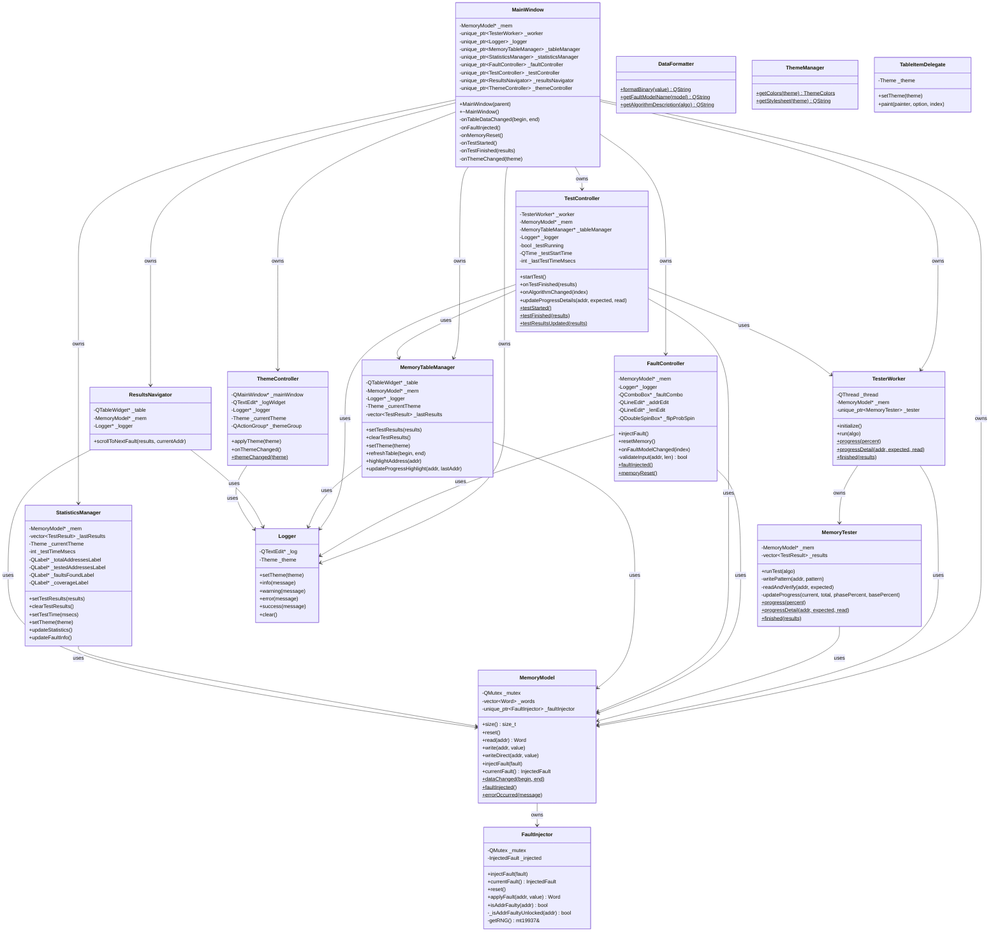
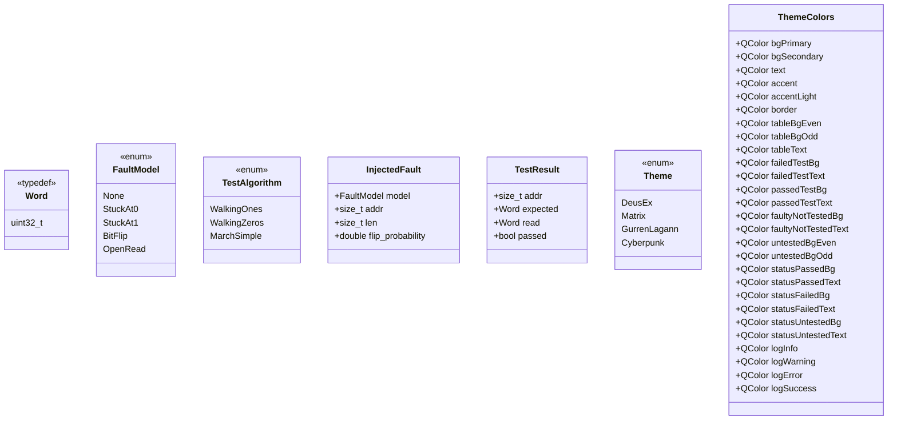
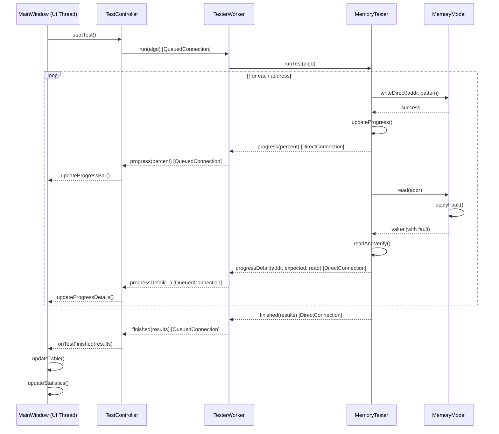

# Диаграмма классов проекта RAM_clone

## Общая архитектура

## Описание классов

### Основные компоненты

#### MainWindow
Главное окно приложения. Управляет всеми компонентами UI и координирует работу между контроллерами и менеджерами.

#### MemoryModel
Модель данных памяти. Обеспечивает потокобезопасный доступ к данным памяти и управляет внедрением неисправностей.

#### FaultInjector
Класс для внедрения неисправностей в память. Применяет различные модели неисправностей (Stuck-at-0, Stuck-at-1, Bit-flip, Open Read) при чтении данных.

#### MemoryTester
Реализует алгоритмы тестирования памяти (Walking 1s, Walking 0s, March Simple). Выполняется в отдельном потоке.

#### TesterWorker
Обертка для выполнения тестирования в отдельном потоке. Управляет жизненным циклом потока и MemoryTester.

### Контроллеры

#### FaultController
Контроллер для управления неисправностями. Обрабатывает пользовательский ввод и валидирует данные перед внедрением неисправностей.

#### TestController
Контроллер для управления тестированием. Запускает тесты, отслеживает прогресс и обрабатывает результаты.

#### ThemeController
Контроллер для управления темами интерфейса. Применяет различные цветовые схемы к приложению.

### Менеджеры

#### MemoryTableManager
Управляет отображением таблицы памяти. Обновляет данные, применяет цветовое кодирование и выделение.

#### StatisticsManager
Управляет отображением статистики тестирования. Вычисляет покрытие, количество найденных неисправностей и другие метрики.

#### ResultsNavigator
Навигация по результатам тестирования. Позволяет переходить к следующей найденной неисправности.

### Вспомогательные классы

#### Logger
Класс для логирования событий в текстовое поле с поддержкой цветового форматирования.

#### DataFormatter
Статический класс для форматирования данных (двоичное представление, названия моделей неисправностей и алгоритмов).

#### ThemeManager
Статический класс для управления темами. Предоставляет цвета и стили для различных тем.

#### TableItemDelegate
Кастомный делегат для отрисовки элементов таблицы с поддержкой специального выделения неисправных ячеек.

## Типы данных

## Потоки выполнения

