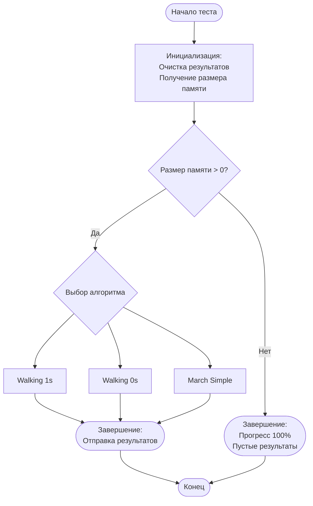
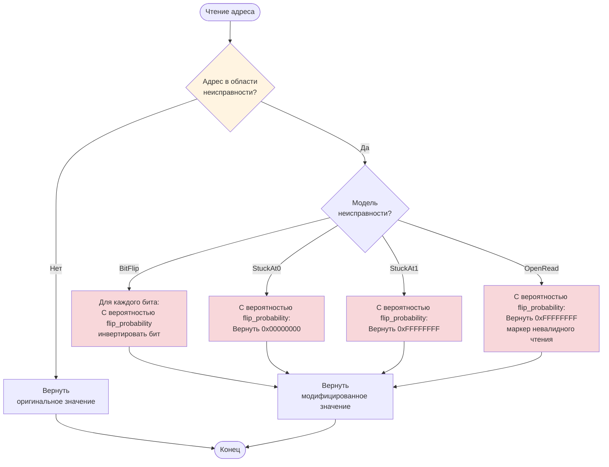
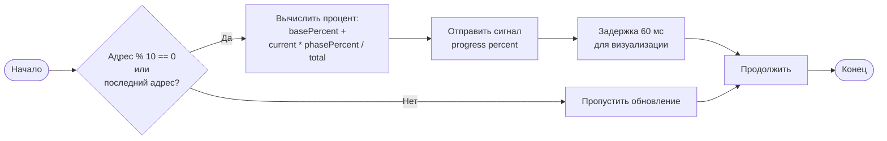

```mermaid
flowchart TD
    Start([Начало Walking 1s]) --> Phase1[Фаза 1: Запись паттернов]
    
    Phase1 --> Loop1[Для каждого адреса a от 0 до n-1]
    Loop1 --> CalcPattern1[Вычислить паттерн:<br/>pattern = 1u << a % 32]
    CalcPattern1 --> Write1[Записать pattern в адрес a<br/>writeDirect a, pattern]
    Write1 --> UpdateProgress1[Обновить прогресс:<br/>basePercent = 0<br/>phasePercent = 50%]
    UpdateProgress1 --> CheckEnd1{a == n-1?}
    CheckEnd1 -->|Нет| Loop1
    CheckEnd1 -->|Да| Phase2[Фаза 2: Чтение и проверка]
    
    Phase2 --> Loop2[Для каждого адреса a от 0 до n-1]
    Loop2 --> CalcExpected1[Вычислить ожидаемое значение:<br/>expected = 1u << a % 32]
    CalcExpected1 --> Read1[Прочитать значение из адреса a<br/>read a]
    Read1 --> ApplyFault1[Применить неисправность<br/>если она внедрена]
    ApplyFault1 --> Compare1[Сравнить:<br/>read == expected?]
    Compare1 --> SaveResult1[Сохранить результат:<br/>TestResult a, expected, read, passed]
    SaveResult1 --> UpdateProgress2[Обновить прогресс:<br/>basePercent = 50%<br/>phasePercent = 50%]
    UpdateProgress2 --> EmitDetail1[Отправить детали прогресса<br/>если a % 10 == 0]
    EmitDetail1 --> CheckEnd2{a == n-1?}
    CheckEnd2 -->|Нет| Loop2
    CheckEnd2 -->|Да| FinalProgress1[Установить прогресс 100%]
    FinalProgress1 --> EmitResults1[Отправить результаты]
    EmitResults1 --> End([Конец])
    
    style Phase1 fill:#e1f5ff
    style Phase2 fill:#fff4e1
    style Write1 fill:#d4edda
    style Read1 fill:#f8d7da
```

```mermaid
flowchart TD
    Start([Начало March Simple]) --> Step1[Шаг 1: Запись всех 0]
    
    Step1 --> Loop1[Для каждого адреса a от 0 до n-1]
    Loop1 --> Write0[Записать 0 в адрес a<br/>writeDirect a, 0]
    Write0 --> UpdateProgress1[Обновить прогресс:<br/>basePercent = 0%<br/>phasePercent = 25%]
    UpdateProgress1 --> CheckEnd1{a == n-1?}
    CheckEnd1 -->|Нет| Loop1
    CheckEnd1 -->|Да| Step2[Шаг 2: Чтение всех 0]
    
    Step2 --> Loop2[Для каждого адреса a от 0 до n-1]
    Loop2 --> Read0[Прочитать значение из адреса a<br/>read a]
    Read0 --> ApplyFault1[Применить неисправность<br/>если она внедрена]
    ApplyFault1 --> Compare0[Сравнить:<br/>read == 0?]
    Compare0 --> SaveResult1[Сохранить результат:<br/>TestResult a, 0, read, passed]
    SaveResult1 --> UpdateProgress2[Обновить прогресс:<br/>basePercent = 25%<br/>phasePercent = 25%]
    UpdateProgress2 --> EmitDetail1[Отправить детали прогресса<br/>если a % 10 == 0]
    EmitDetail1 --> CheckEnd2{a == n-1?}
    CheckEnd2 -->|Нет| Loop2
    CheckEnd2 -->|Да| Step3[Шаг 3: Запись всех 1]
    
    Step3 --> Loop3[Для каждого адреса a от 0 до n-1]
    Loop3 --> Write1[Записать ~0 в адрес a<br/>writeDirect a, ~0]
    Write1 --> UpdateProgress3[Обновить прогресс:<br/>basePercent = 50%<br/>phasePercent = 25%]
    UpdateProgress3 --> CheckEnd3{a == n-1?}
    CheckEnd3 -->|Нет| Loop3
    CheckEnd3 -->|Да| Step4[Шаг 4: Чтение всех 1]
    
    Step4 --> Loop4[Для каждого адреса a от 0 до n-1]
    Loop4 --> Read1[Прочитать значение из адреса a<br/>read a]
    Read1 --> ApplyFault2[Применить неисправность<br/>если она внедрена]
    ApplyFault2 --> Compare1[Сравнить:<br/>read == ~0?]
    Compare1 --> SaveResult2[Сохранить результат:<br/>TestResult a, ~0, read, passed]
    SaveResult2 --> UpdateProgress4[Обновить прогресс:<br/>basePercent = 75%<br/>phasePercent = 25%]
    UpdateProgress4 --> EmitDetail2[Отправить детали прогресса<br/>если a % 10 == 0]
    EmitDetail2 --> CheckEnd4{a == n-1?}
    CheckEnd4 -->|Нет| Loop4
    CheckEnd4 -->|Да| FinalProgress[Установить прогресс 100%]
    FinalProgress --> EmitResults[Отправить результаты]
    EmitResults --> End([Конец])
    
    style Step1 fill:#e1f5ff
    style Step2 fill:#fff4e1
    style Step3 fill:#e1f5ff
    style Step4 fill:#fff4e1
    style Write0 fill:#d4edda
    style Write1 fill:#d4edda
    style Read0 fill:#f8d7da
    style Read1 fill:#f8d7da
```

# Схемы алгоритмов тестирования памяти

## Общая структура алгоритмов

Все алгоритмы тестирования следуют общей структуре:



## Алгоритм Walking 1s

### Описание
Алгоритм записывает единицу в каждый бит слова и проверяет, что она корректно читается. Для каждого адреса создается паттерн с одной единицей в позиции `(адрес % 32)`.

### Схема алгоритма



### Псевдокод
```
WalkingOnes():
    results = []
    n = memory.size()
    
    // Фаза 1: Запись
    for a = 0 to n-1:
        pattern = 1u << (a % 32)
        memory.writeDirect(a, pattern)
        updateProgress(a, n, 50%, 0%)
    
    // Фаза 2: Чтение и проверка
    for a = 0 to n-1:
        expected = 1u << (a % 32)
        read = memory.read(a)  // Неисправности применяются здесь
        passed = (read == expected)
        results.append({a, expected, read, passed})
        updateProgress(a, n, 50%, 50%)
    
    emit finished(results)
```

### Пример выполнения
Для памяти размером 4 слова (32 бита каждое):
- Адрес 0: запись `0x00000001`, чтение и проверка
- Адрес 1: запись `0x00000002`, чтение и проверка
- Адрес 2: запись `0x00000004`, чтение и проверка
- ...
- Адрес 31: запись `0x80000000`, чтение и проверка
- Адрес 32: запись `0x00000001` (цикл повторяется), чтение и проверка

## Алгоритм Walking 0s

### Описание
Алгоритм записывает ноль в каждый бит слова и проверяет, что он корректно читается. Для каждого адреса создается паттерн с одним нулем в позиции `(адрес % 32)`, все остальные биты установлены в 1.

### Схема алгоритма

```mermaid
flowchart TD
    Start([Начало Walking 0s]) --> Phase1[Фаза 1: Запись паттернов]
    
    Phase1 --> Loop1[Для каждого адреса a от 0 до n-1]
    Loop1 --> CalcPattern2[Вычислить паттерн:<br/>pattern = ~(1u << a % 32)]
    CalcPattern2 --> Write2[Записать pattern в адрес a<br/>writeDirect a, pattern]
    Write2 --> UpdateProgress3[Обновить прогресс:<br/>basePercent = 0<br/>phasePercent = 50%]
    UpdateProgress3 --> CheckEnd3{a == n-1?}
    CheckEnd3 -->|Нет| Loop1
    CheckEnd3 -->|Да| Phase2[Фаза 2: Чтение и проверка]
    
    Phase2 --> Loop2[Для каждого адреса a от 0 до n-1]
    Loop2 --> CalcExpected2[Вычислить ожидаемое значение:<br/>expected = ~(1u << a % 32)]
    CalcExpected2 --> Read2[Прочитать значение из адреса a<br/>read a]
    Read2 --> ApplyFault2[Применить неисправность<br/>если она внедрена]
    ApplyFault2 --> Compare2[Сравнить:<br/>read == expected?]
    Compare2 --> SaveResult2[Сохранить результат:<br/>TestResult a, expected, read, passed]
    SaveResult2 --> UpdateProgress4[Обновить прогресс:<br/>basePercent = 50%<br/>phasePercent = 50%]
    UpdateProgress4 --> EmitDetail2[Отправить детали прогресса<br/>если a % 10 == 0]
    EmitDetail2 --> CheckEnd4{a == n-1?}
    CheckEnd4 -->|Нет| Loop2
    CheckEnd4 -->|Да| FinalProgress2[Установить прогресс 100%]
    FinalProgress2 --> EmitResults2[Отправить результаты]
    EmitResults2 --> End([Конец])
    
    style Phase1 fill:#e1f5ff
    style Phase2 fill:#fff4e1
    style Write2 fill:#d4edda
    style Read2 fill:#f8d7da
```

### Псевдокод
```
WalkingZeros():
    results = []
    n = memory.size()
    
    // Фаза 1: Запись
    for a = 0 to n-1:
        pattern = ~(1u << (a % 32))
        memory.writeDirect(a, pattern)
        updateProgress(a, n, 50%, 0%)
    
    // Фаза 2: Чтение и проверка
    for a = 0 to n-1:
        expected = ~(1u << (a % 32))
        read = memory.read(a)  // Неисправности применяются здесь
        passed = (read == expected)
        results.append({a, expected, read, passed})
        updateProgress(a, n, 50%, 50%)
    
    emit finished(results)
```

### Пример выполнения
Для памяти размером 4 слова:
- Адрес 0: запись `0xFFFFFFFE`, чтение и проверка
- Адрес 1: запись `0xFFFFFFFD`, чтение и проверка
- Адрес 2: запись `0xFFFFFFFB`, чтение и проверка
- ...

## Алгоритм March Simple

### Описание
Простой маршевый тест, который выполняет последовательность операций записи и чтения для проверки способности памяти сохранять значения. Тест состоит из 4 шагов: запись всех нулей, чтение всех нулей, запись всех единиц, чтение всех единиц.

### Схема алгоритма



### Псевдокод
```
MarchSimple():
    results = []
    n = memory.size()
    
    // Шаг 1: Запись всех 0
    for a = 0 to n-1:
        memory.writeDirect(a, 0)
        updateProgress(a, n, 25%, 0%)
    
    // Шаг 2: Чтение всех 0
    for a = 0 to n-1:
        read = memory.read(a)  // Неисправности применяются здесь
        passed = (read == 0)
        results.append({a, 0, read, passed})
        updateProgress(a, n, 25%, 25%)
    
    // Шаг 3: Запись всех 1
    for a = 0 to n-1:
        memory.writeDirect(a, ~0)
        updateProgress(a, n, 25%, 50%)
    
    // Шаг 4: Чтение всех 1
    for a = 0 to n-1:
        read = memory.read(a)  // Неисправности применяются здесь
        passed = (read == ~0)
        results.append({a, ~0, read, passed})
        updateProgress(a, n, 25%, 75%)
    
    emit finished(results)
```

### Пример выполнения
Для памяти размером 4 слова:
1. **Шаг 1**: Запись `0x00000000` во все адреса
2. **Шаг 2**: Чтение всех адресов, ожидается `0x00000000`
3. **Шаг 3**: Запись `0xFFFFFFFF` во все адреса
4. **Шаг 4**: Чтение всех адресов, ожидается `0xFFFFFFFF`

## Применение неисправностей

Все алгоритмы применяют неисправности только при **чтении** данных. Запись всегда сохраняет точное значение.



## Сравнение алгоритмов

| Характеристика | Walking 1s | Walking 0s | March Simple |
|----------------|------------|-----------|--------------|
| Количество фаз | 2 | 2 | 4 |
| Операций записи | n | n | 2n |
| Операций чтения | n | n | 2n |
| Всего операций | 2n | 2n | 4n |
| Покрытие битов | Каждый бит по отдельности | Каждый бит по отдельности | Все биты одновременно |
| Обнаружение Stuck-at-0 | ✅ | ✅ | ✅ |
| Обнаружение Stuck-at-1 | ✅ | ✅ | ✅ |
| Обнаружение Bit-flip | ✅ | ✅ | ⚠️ (частично) |
| Обнаружение Open Read | ✅ | ✅ | ✅ |
| Время выполнения | Среднее | Среднее | Дольше |

## Визуализация прогресса

Все алгоритмы обновляют прогресс следующим образом:



## Потокобезопасность

Все операции с памятью выполняются через потокобезопасные методы `MemoryModel`:

- `read()` - защищен мьютексом
- `write()` - защищен мьютексом
- `writeDirect()` - защищен мьютексом
- `size()` - защищен мьютексом

Тестирование выполняется в отдельном потоке, сигналы передаются в главный поток через `QueuedConnection`.

