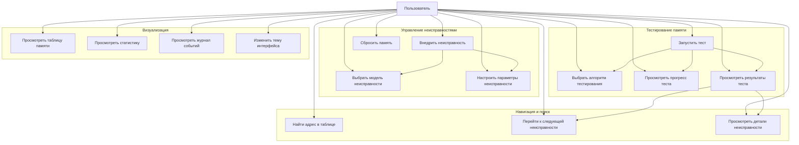
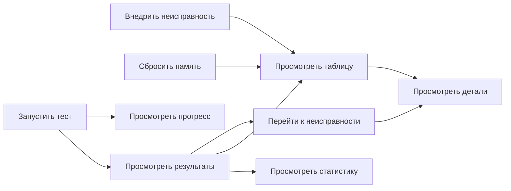

# Use Case диаграмма проекта RAM_clone

## Основные сценарии использования

## Детальное описание Use Cases

### 1. Управление неисправностями

#### UC1: Внедрить неисправность
**Актор:** Пользователь  
**Предусловия:** Память инициализирована  
**Основной поток:**
1. Пользователь выбирает модель неисправности (Stuck-at-0, Stuck-at-1, Bit-flip, Open Read)
2. Пользователь вводит адрес начала области неисправности
3. Пользователь вводит длину области неисправности
4. Пользователь настраивает вероятность (для Bit-flip и других моделей)
5. Пользователь нажимает кнопку "Внедрить неисправность"
6. Система валидирует ввод
7. Система внедряет неисправность в указанную область памяти
8. Система обновляет таблицу памяти и статистику
9. Система логирует операцию

**Альтернативные потоки:**
- 6a. Если ввод невалиден, система показывает сообщение об ошибке
- 6b. Если адрес выходит за пределы памяти, система корректирует длину

#### UC2: Сбросить память
**Актор:** Пользователь  
**Предусловия:** -  
**Основной поток:**
1. Пользователь нажимает кнопку "Сбросить память"
2. Система очищает все данные памяти
3. Система удаляет все внедренные неисправности
4. Система очищает результаты тестирования
5. Система обновляет таблицу памяти и статистику
6. Система логирует операцию

#### UC3: Выбрать модель неисправности
**Актор:** Пользователь  
**Основной поток:**
1. Пользователь выбирает модель из выпадающего списка
2. Система автоматически устанавливает значение вероятности по умолчанию
3. Система обновляет описание модели неисправности

#### UC4: Настроить параметры неисправности
**Актор:** Пользователь  
**Основной поток:**
1. Пользователь вводит адрес (0-255)
2. Пользователь вводит длину области
3. Пользователь устанавливает вероятность (0.0-1.0)
4. Система валидирует ввод в реальном времени

### 2. Тестирование памяти

#### UC5: Запустить тест
**Актор:** Пользователь  
**Предусловия:** Выбран алгоритм тестирования  
**Основной поток:**
1. Пользователь выбирает алгоритм тестирования
2. Пользователь нажимает кнопку "Запустить тест"
3. Система проверяет, что тест не выполняется
4. Система запускает тест в отдельном потоке
5. Система отображает прогресс теста
6. Система обновляет детали текущего адреса
7. Система завершает тест и отображает результаты
8. Система обновляет статистику и таблицу памяти
9. Система логирует результаты

**Альтернативные потоки:**
- 3a. Если тест уже выполняется, система показывает предупреждение

#### UC6: Выбрать алгоритм тестирования
**Актор:** Пользователь  
**Основной поток:**
1. Пользователь выбирает алгоритм из выпадающего списка
2. Система отображает описание выбранного алгоритма
3. Система обновляет информацию о текущем алгоритме в статистике

**Алгоритмы:**
- Walking 1s: Записывает единицу в каждый бит и проверяет чтение
- Walking 0s: Записывает ноль в каждый бит и проверяет чтение
- March Simple: Простой маршевый тест (запись 0, проверка 0, запись 1, проверка 1)

#### UC7: Просмотреть прогресс теста
**Актор:** Пользователь  
**Основной поток:**
1. Во время выполнения теста система отображает:
   - Процент выполнения (0-100%)
   - Текущий адрес
   - Ожидаемое значение
   - Прочитанное значение
   - Выделение текущего адреса в таблице
2. Система обновляет информацию каждые N адресов

#### UC8: Просмотреть результаты теста
**Актор:** Пользователь  
**Основной поток:**
1. После завершения теста система отображает:
   - Общее количество проверенных адресов
   - Количество найденных неисправностей
   - Покрытие тестированием
   - Время выполнения теста
2. Система выделяет неисправные адреса в таблице красным цветом
3. Система обновляет статус каждого адреса в таблице

### 3. Навигация и поиск

#### UC9: Найти адрес в таблице
**Актор:** Пользователь  
**Основной поток:**
1. Пользователь вводит адрес в поле поиска
2. Пользователь нажимает кнопку "Найти"
3. Система валидирует ввод
4. Система выделяет строку с указанным адресом
5. Система прокручивает таблицу к найденному адресу

**Альтернативные потоки:**
- 3a. Если адрес невалиден, система показывает сообщение об ошибке

#### UC10: Перейти к следующей неисправности
**Актор:** Пользователь  
**Предусловия:** Выполнен тест с найденными неисправностями  
**Основной поток:**
1. Пользователь нажимает кнопку "Следующая неисправность"
2. Система находит следующую неисправность после текущей позиции
3. Система выделяет найденную неисправность
4. Система прокручивает таблицу к найденной неисправности
5. Если достигнут конец списка, система переходит к началу (циклический поиск)

#### UC11: Просмотреть детали неисправности
**Актор:** Пользователь  
**Основной поток:**
1. Пользователь выбирает строку в таблице памяти
2. Система отображает детали адреса:
   - Адрес
   - HEX значение
   - Двоичное значение
   - Десятичное значение
   - Статус (Исправна/Неисправна/Не протестировано)
   - Тип неисправности
3. Если адрес неисправен, система показывает tooltip с ожидаемым и прочитанным значением

### 4. Визуализация

#### UC12: Просмотреть таблицу памяти
**Актор:** Пользователь  
**Основной поток:**
1. Система отображает таблицу со всеми адресами памяти
2. Для каждого адреса отображается:
   - Адрес
   - HEX значение
   - Двоичное значение
   - Десятичное значение
   - Статус
   - Тип неисправности
3. Система применяет цветовое кодирование:
   - Красный: неисправность обнаружена тестом
   - Зеленый: адрес протестирован и исправен
   - Желтый/Золотой: область с неисправностью, но не протестирована
   - Темный: адрес не протестирован

#### UC13: Просмотреть статистику
**Актор:** Пользователь  
**Основной поток:**
1. Система отображает статистику:
   - Всего адресов
   - Протестировано адресов
   - Найдено неисправностей
   - Покрытие тестированием (%)
   - Время выполнения последнего теста
   - Текущая модель неисправности
   - Текущий алгоритм тестирования
   - Информация о внедренной неисправности
   - Описание текущего алгоритма

#### UC14: Просмотреть журнал событий
**Актор:** Пользователь  
**Основной поток:**
1. Система отображает журнал событий с цветовым форматированием:
   - Информационные сообщения (золотистый/зеленый)
   - Предупреждения (желтый/оранжевый)
   - Ошибки (красный)
   - Успешные операции (зеленый/синий)
2. Пользователь может очистить журнал
3. Система автоматически добавляет записи о всех операциях

#### UC15: Изменить тему интерфейса
**Актор:** Пользователь  
**Основной поток:**
1. Пользователь выбирает тему из меню "Вид"
2. Система применяет выбранную тему ко всему интерфейсу:
   - Цвета фона и текста
   - Цвета кнопок и элементов управления
   - Цвета таблицы памяти
   - Цвета журнала событий
3. Система сохраняет выбранную тему до следующего изменения

**Доступные темы:**
- Deus Ex (золотистая тема)
- Matrix (зеленая тема)
- Gurren Lagann (красно-синяя тема)
- Cyberpunk (неоновая тема)

## Диаграмма взаимодействия Use Cases

## Сценарии использования (примеры)

### Сценарий 1: Полный цикл тестирования
1. Пользователь внедряет неисправность Bit-flip по адресу 50, длина 10
2. Пользователь выбирает алгоритм "Walking 1s"
3. Пользователь запускает тест
4. Система выполняет тест и отображает прогресс
5. Система находит неисправности в адресах 50-59
6. Пользователь просматривает результаты в таблице
7. Пользователь переходит к следующей неисправности
8. Пользователь просматривает статистику

### Сценарий 2: Сравнение алгоритмов
1. Пользователь внедряет неисправность Stuck-at-0 по адресу 100, длина 5
2. Пользователь запускает тест "Walking 1s"
3. Пользователь просматривает результаты
4. Пользователь сбрасывает память
5. Пользователь внедряет ту же неисправность
6. Пользователь запускает тест "March Simple"
7. Пользователь сравнивает результаты и статистику

### Сценарий 3: Навигация по результатам
1. Пользователь запускает тест и получает результаты с несколькими неисправностями
2. Пользователь нажимает "Следующая неисправность" для перехода между найденными проблемами
3. Пользователь использует поиск для перехода к конкретному адресу
4. Пользователь просматривает детали каждой неисправности в таблице

